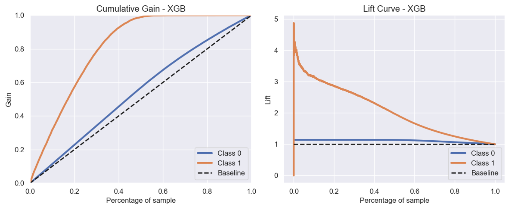
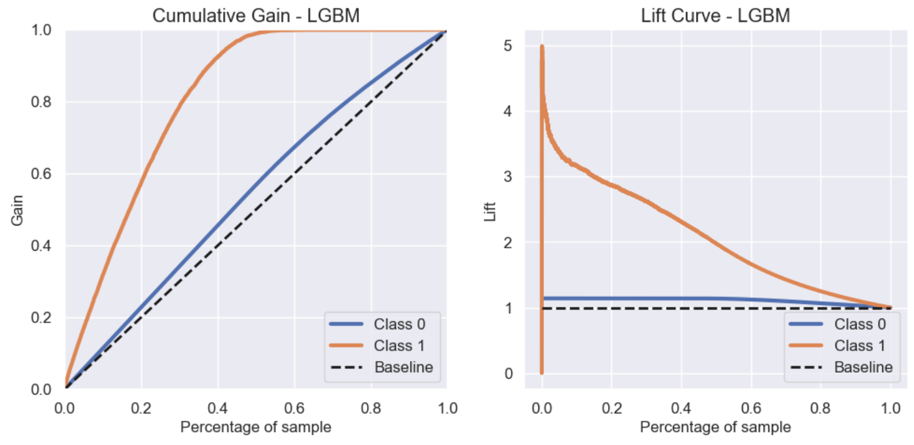

# Health insurance cross sell prediction

**Disclaimer**: Health Insurance Cross Sell is a Learn to Rank project, based on this [Kaggle Competition](https://www.kaggle.com/datasets/anmolkumar/health-insurance-cross-sell-prediction). The context, company and business problem are ficticial.

# 1. Business scenario

This study project was carried out with the aim of solving the business problem of Insurance All company, using machine learning algorithms and data science concepts to calculate the probability of a customer acquiring a new product from the company. In this way, the company can focus on customers with a higher interest in acquiring the new product, being more efficient in the use of its resources.

Keeping in mind the accessibility of the user, the solution for this project was developed within Google Sheets, where the machine learning algorithm was connected to it, and with just one click, the user is able to obtain an ordered list, starting with the customer with the highest interest in acquiring the product.

As a result of this project, Insurance All company was able to increase its profitability due to the significant reduction in the use of resources such as time and unnecessary calls.

## 1.1 - Insurance All

Insurance All is a company that provides health insurance to its customers and the product team is analyzing the possibility of offering its insured a new product: A car insurance. 

Aiming to reduce the customer acquisiton cost, the company decided to use a cross-sell strategy, that consist in selling a second product to an existing client.

## 1.2 - Business Problems

Insurance All conducted a survey with approximately 380,000 customers about their interest in joining a new car insurance product last year. All customers demonstrated interest or not in acquiring car insurance and these answers were saved in a database along with other customer attributes.

The product team selected 127,000 new customers who did not respond to the survey to participate in a campaign, in which they will receive the offer of the new car insurance product. The offer will be made by the sales team through phone calls. However, the sales team has a capacity to make 20,000 calls within the campaign period.

In this context, you have been hired as a Data Science consultant to build a model that predicts if the customer would be interested or not in car insurance.

With your solution, the sales team expects to prioritize people with higher interest in the new product and thus optimize the campaign by only contacting the customers most likely to make the purchase.

# 2 - Solution Strategy

The solution follows the **CRISP-DM** (Cross-Industry Standard Process for Data Mining), which is a cyclic method of development. At the end of the first cycle, the team will have a first version end-to-end of this solution, allowing them to achieve good results faster, identify and address potential problems effectively.

**Step 01. Data Description:** My goal is to use statistics metrics to identify data outside the scope of business.

**Step 02. Feature Engineering:** Derive new attributes based on the original variables to better describe the phenomenon that will be modeled.

**Step 03. Data Filtering:** Filter rows and select columns that do not contain information for modeling or that do not match the scope of the business.

**Step 04. Exploratory Data Analysis:** Explore the data to find insights and better understand the impact of variables on model learning.

**Step 05. Data Preparation:** Prepare the data so that the Machine Learning models can learn the specific behavior.

**Step 06. Feature Selection:** Selection of the most significant attributes for training the model.

**Step 07. Machine Learning Modelling:** Machine Learning model training.

**Step 08. Hyperparameter Fine Tunning:** Choose the best values for each of the parameters of the model selected from the previous step.

**Step 09. Convert Model Performance to Business Values:** Convert the performance of the Machine Learning model into a business result.

**Step 10. Deploy Modelo to Production:** Publish the model in a cloud environment so that other people or services can use the results to improve the business decision.

# 4. Top 3 Data insights

**1. The interest on purchase the vehicle insurance is greater for customers that damaged their vehicle before and doesn't have insurance.**
    False, of the customers that damaged their car and doesn't have insurance, only 25% show interest in acquire vehicle insurance.

**2. The interest on purchase the vehicle insurance is greater for woman than men.**
   False, only 10% of women show interest in acquire vehicle insurance, whereas 13% of the men show interest on acquire vehicle insurance.

**3. The interest on purchase vehicle insurance is greater for vintage customers ( 7 months or more ).**
    False, the period that customers are on the company doensn't show influency on interest in buying vehicle insurance.

**4. The interest on purchase the vehicle insurance is greater for young customers.(Between 18 and 30 years old.)**
    False, customers that spend more than 30k yearly show greter interest on purchase vehicle insurance.

**5. The interest on purchase the vehicle insurance is greater for young customers.(Between 18 and 30 years old.)**
    False, adults and elderlies show greater interest on buying vehicle insurance.

**6. The interest on purchase the vehicle insurance is greater for customers that have driver license.**
    True, arround 12% of customers that hold a driving license show interest in buying the vehicle insurance.

**7. The interest on purchase the vehicle insurance is greater for customers that have new cars.**
    False, the interest is greater for customers that own an old car.

**8. The interest on purchase the vehicle insurance is greater for customers that have new cars and have damaged their vehicles.**
    False, of the customers who damaged their car, the ones that own a old car show greater interest in buying the vehicle insurance (29%), followed by customers that own used cars (27%).

**9. The interest on purchase the vehicle insurance is greater for elderly women.**
    False, adult women show greater interest in buying the vehicle insurance.

**10. The interest on purchase the vehicle insurance is lower for customers that are already insured.**
    True, less than 1% of customers already insured show interest on purchase the vehicle insurance.

# 5. Machine learning models applied
In this phase, we selected 3 ML models to work with:
- KNN Classifier
- LGBM Classifier
- XGBoost Classifier

Were LGBM and XGboost performed very close each other and better than KNN.

| ML Model                | Precision @K            | Recall @K              |
|:------------------------|:------------------------|:-----------------------|
| LGBM                    | 0.2686    +/- 0.0005    | 0.9567   +/- 0.0019    | 
| XGB                     | 0.2669    +/- 0.0009    | 0.9507   +/- 0.0031    |
| KNN                     | 0.2276    +/2 0.0037    | 0.8108   +/2 0.0037    |

To further advance the project, hyperparameter fine-tuning was performed on the LGBM (LightGBM) and XGBoost models using a bysean search algorithm.

# 6. Machine learning model performance

In this step, we selected the XGB Classifier and LGBM Classifier algorithms to be executed with their parameters tuned. We evaluated their performance using the test dataset, which simulates real data, aiming to analyze their performance closely as if one of them were in production.

The performance for both models could be checked bellow:
| ML Model                | Precision @20.000         | Recall @20.000        |
|:------------------------|:------------------------|:-----------------------|
| LGBM                    | 0.33435                 | 0.713204               | 
| XGB                     | 0.33365                 | 0.711711               |

Besides of recall and precision metrics, for a Learn to Rank problem is a good practrice to analyze the Cumulative Gain and Lift Curve chart, that helps to have a easy understanding about the model performance.

Firstly, we evaluated the metrics using a dataset of 20,000 records, which makes up about 27% of the total dataset.

By examining the Cumulative Gain chart, we can observe that if we were to reach out to approximately 20,000 clients (which represents around 27% of the total), we would be able to successfully contact 80% of the interested customers. 

Discussing the lift curve chart, we can see that our model performs approximately three times better than the random selection process, for 27% of the data (20.000 clients). 

# 7. Business Results

1 - The cost for contacting each client has been set at $40.00.

2 - The minimum price for the new product has been set at $1,100.00.

3 - Scores above 0.6 have been set to represent interested customers.

## 7.1 - Business Questions

### 1 - What percentage of customers interested in purchasing car insurance will the sales team be able to contact by making 20,000 calls?
**By doing 20.000 calls, the sales team will make contact with 32% of the interested customers, resulting in a revenue of $6.179.500,00.**

### 2 - If the sales team's capacity increases to 40,000 calls, what percentage of customers interested in purchasing car insurance will the sales team be able to contact?
**By doing 40.000 calls, the sales team will make contact with 16% of the interested customers, resulting in a revenue of 5.379.500,00.**

### 3 - How many calls does the sales team need to make to contact 80% of customers interested in purchasing car insurance?
**By doing 5076 calls, the sales team will make contact with 80% of the interested customers, resulting in a revenue of $6.776.460,00**

# 8. Next steps to improve
As this was the first cycle, there are improvements to be considered in order to achieve the best performance.
- Work on feature engineering, creating new features that could better explain the phenomenon.
- Get more data and re-training the ML model.
- Try to use others ML Models.

# 9 - Technologies

# AUTHOR
Ricardo Perottoni

###### All Rights Reserved - Comunidade DS 2022
