**Disclaimer**: The context, Company, CEO and business questions are ficticial.

Este projeto de estudo foi realizado com o intuito de resolver o problema de negocio da empresa Insurance All, fazendo uso de algoritmos de machine learning e conceitos de ciencia de dados afim de calcular a probabilidade de um cliente em adquirir um novo produto da empresa. Desta forma, a empresa consegue focar em clietes com maior interesse em adquirir o novo produto, sendo mais eficiente no uso de seus recursos.

Pensando na acessibilidade do usuario final, a solucao deste projeto foi desenvolvida dentro do google sheets, onde o algoritmo de machine learning foi conectado a ela e com apenas um clique, o usuario e capaz de obter uma lista ordenada, comecando pelo cliente com o maior interesse em adquirir o produto.

Como resultado deste projeto, a empresa Insurance All pode aumentar sua lucratividade em xxx%, devido a reducao significativa no uso de recursos como: tempo e ligacoes desnecessarias.1

# 1 - Business Problems

## 1.1 - Insurance All

Insurance All is a company that provides health insurance to its customers and the product team is analyzing the possibility of offering its insured a new product: A car insurance. 

Aiming to reduce the customer acquisiton cost, the company decided to use a cross-sell strategy, that consist in selling a second product to an existing client.

## 1.2 - Business Problems

Insurance All conducted a survey with approximately 380,000 customers about their interest in joining a new car insurance product last year. All customers demonstrated interest or not in acquiring car insurance and these answers were saved in a database along with other customer attributes.

The product team selected 127,000 new customers who did not respond to the survey to participate in a campaign, in which they will receive the offer of the new car insurance product. The offer will be made by the sales team through phone calls. However, the sales team has a capacity to make 20,000 calls within the campaign period.

In this context, you have been hired as a Data Science consultant to build a model that predicts if the customer would be interested or not in car insurance.

With your solution, the sales team expects to prioritize people with higher interest in the new product and thus optimize the campaign by only contacting the customers most likely to make the purchase.

## 1.3 - About the Data
The data used on this project are from this [Kaggle Competition](https://www.kaggle.com/datasets/anmolkumar/health-insurance-cross-sell-prediction) 

The dataset used for the solution development has approximately 380.000 registrations and the customer attributes are described bellow.

---
| Column | Description |
| --- | --- |
|id|                    Unique ID for each customer |
|gender|                Customer gender |
|age|                   Customer age |
|region_code|           Region code where the customer lives |
|policy_sales_channel|  Channel code of contact chosen by the customer |
|driving_license|       Does the customer have a driving license? |
|vehicle_age|           Age of the customer's car |
|vehicle_damage|        Was the customer's car damaged? |
|previously_insured|    Has the customer been insured previously? |
|annual_premium|        Annual premium value (for health insurance) |
|vintage|               Number of days for which the customer has health insurance |
|response|              Is the customer interested in having car insurance? |

# 2 - Solution Strategy

The solution follows the **CRISP-DM** (Cross-Industry Standard Process for Data Mining), which is a cyclic method of development. At the end of the first cycle, the team will have a first version end-to-end of this solution, allowing them to achieve good results faster and identify and address potential problems effectively.

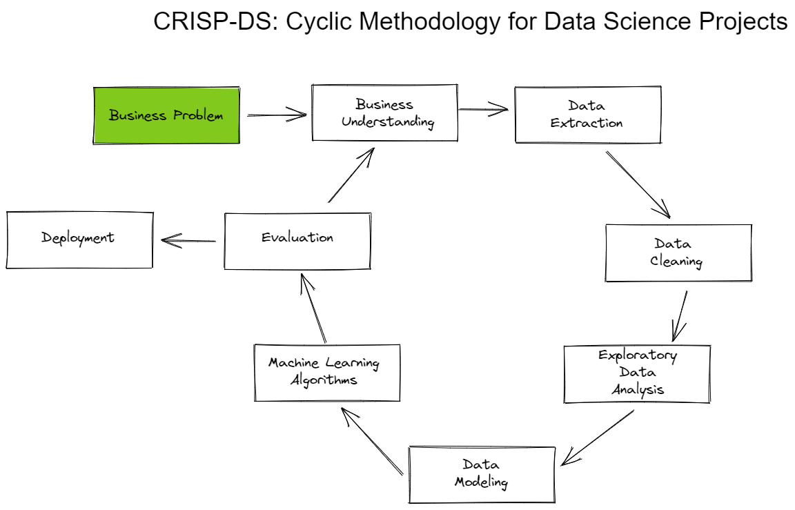

## 2.1 - Business Understanding

In this initial phase, the focus was on understanding the company's business and clarify wich are the project's objectives and requirements.

## 2.2 - Data Extraction and Data Descriptive

In this phase, the aim was to collect tha datas from the database. Where was used SQL and a Python library called pandas.

 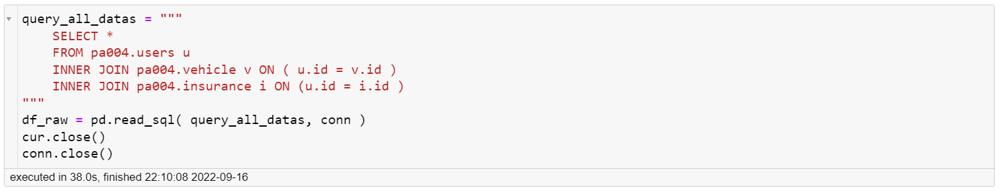

Also were done a data descriptive, focusing on identify and udenderstand if there are some outliers, missing values and data distribution for each feature, individually.
The descriptive analysis can be accessed at the link bellow.

[Descriptive Analysis](notebooks/data_descriptive.html)

Before starting to work with the data, the dataset was separated into 3 new datasets, which were used to ensure machine learning model training without overfitting.

The 3 new dataset are presented below:

**Train**: contains around 70% of data and it's used for machine learning algorithm training. 

**Validation**: contains around 15% of data and it's used to set the best parameters.

**Test**: Also contains around 15% of the data and it's used to evaluate the model performance.

## 2.3 - Data Cleaning and feature engineering
Data clenaing not required.

As part of the feature engineering process in the first cycle, two features were modified. Initially, these features contained object values but were transformed into numerical values.

## 2.4 - Exploratory Data Analysis
This phase has involved exploring the data, identifying patterns, and gaining insights into its characteristics.

- Univariate Analysis
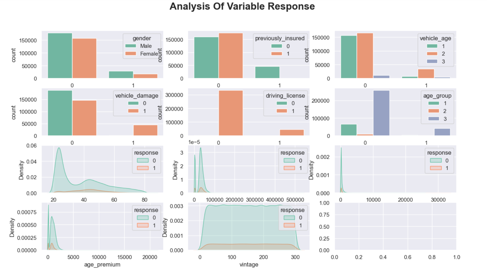

- Bivariate Analysis
In this phase were created businees assumptions to be checked if are true or false. This could be checked out on phase 3 bellow.

- Multivariate Analysis
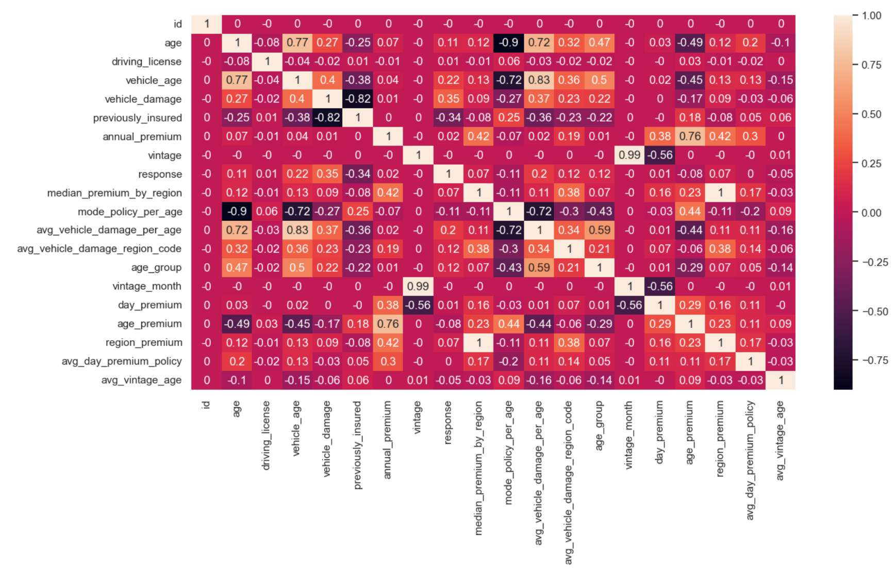

## 2.5 - Data Modeling
In this phase were done data transformations to normalize the scale of features, help make the distribution more summetrical aiming to improve the ML model performance.

Data transformations methods used:
- Frequency Encode
- Standard Scaler
- Min. Max. Scaler

These transformation were applied on training and validation dataset.

## 2.6 - Machine Learning Algorithms

### 2.6.1 - Feature Selection
This phase started by doing a feture selection using Extra Trees Classifier, aiming to select only the most important features to be used to train the machine learning models.

### 2.6.2 - Machine Learning Model training and performance
In this phase, we selected 3 ML models to work with:
- KNN Classifier
- LGBM Classifier
- XGBoost Classifier

Were LGBM and XGboost performed very close each other and better than KNN.

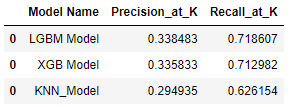

To further advance the project, hyperparameter fine-tuning was performed on the LGBM (LightGBM) and XGBoost models using a random search technique. After evaluating their performance, it was found that both algorithms performed similarly in terms of predictive accuracy.

Considering the specific requirements of this project, a decision was made to proceed with using XGBoost over LGBM. This choice was driven by the fact that XGBoost is lighter in terms of computational resources compared to LGBM.

## 2.6 - Evaluation

In this project, the metric to be considered will be precision. This decision is based on the business problem, where the company has limited resources and wants to maximize the efficiency of its sales area. 

Precision focuses on correctly identifying the customers who are likely to make a purchase, minimizing false positives and ensuring that the company is targeting the most relevant prospects. By prioritizing precision, the company can make every effort count towards reaching potential customers who are more likely to convert and purchase the product.

To ensure a more reliable assessment of the model's performance and its generalization ability when deployed in a production environment, a cross-validation was conducted. Cross-validation helps in evaluating the model's performance more closely to what can be expected in real-world scenarios.
The performance of the algorithm after cross-validation can be assessed below.

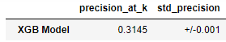

The lift curve represents how a model performs in comparison to a baseline. It is a visual representation of the model's predictive power in relation to random selection. 

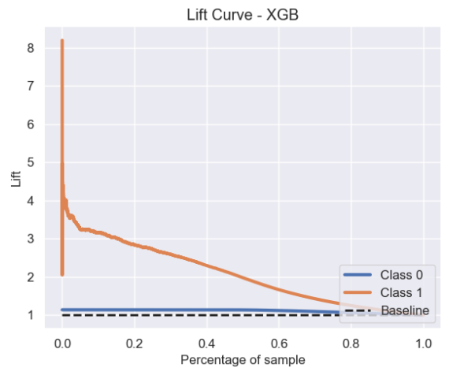

Based on the graph above, it is possible to identify that the proposed model performs approximately three times better than a random selection, when workin with 20% of the data. This indicates that the model is significantly more effective at identifying the target group compared to randomly selecting individuals. The lift curve graph demonstrates the substantial improvement achieved by the model in terms of performance and targeting efficiency.

## 2.6 - Deployment
To make the solution available and operational for the users we wrote our ETL using Flask framework and we integrated it at Render platform.

As Data Scientists, it is our duty to consider how to deliver our solutions effectively within the company. Whenever possible, we should strive to make the user experience as easy as possible. In this project, for example, the solution was delivered as an automation using Google Sheets, allowing the user to simply click a button to obtain the propensity for each customer.

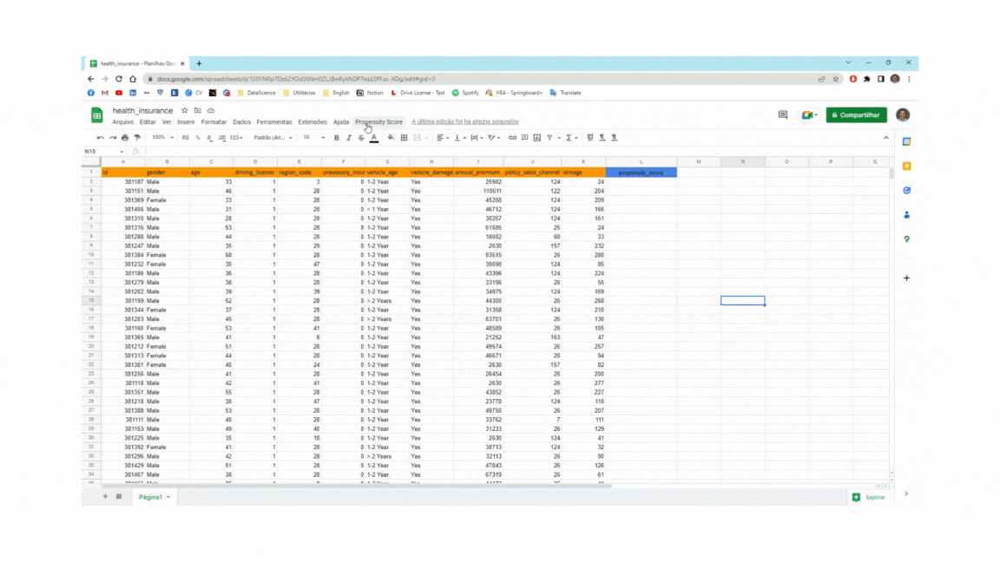

# 3. Data Insights

**1. The interest on purchase the vehicle insurance is greater for customers that damaged their vehicle before and doesn't have insurance.**
    False, of the customers that damaged their car and doesn't have insurance, only 25% show interest in acquire vehicle insurance.
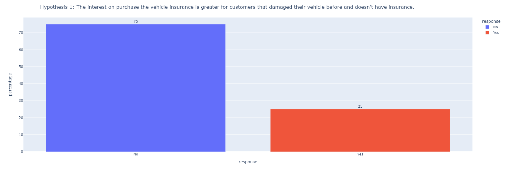

**2. The interest on purchase the vehicle insurance is greater for woman than men.**
   False, only 10% of women show interest in acquire vehicle insurance, whereas 13% of the men show interest on acquire vehicle insurance.
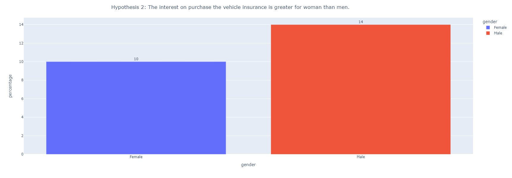

**3. The interest on purchase vehicle insurance is greater for vintage customers ( 7 months or more ).**
    False, the period that customers are on the company doensn't show influency on interest in buying vehicle insurance.
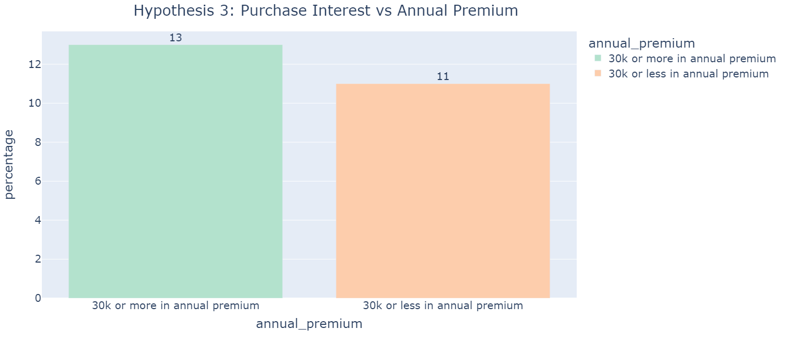

**4. The interest on purchase the vehicle insurance is greater for young customers.(Between 18 and 30 years old.)**
    False, customers that spend more than 30k yearly show greter interest on purchase vehicle insurance.
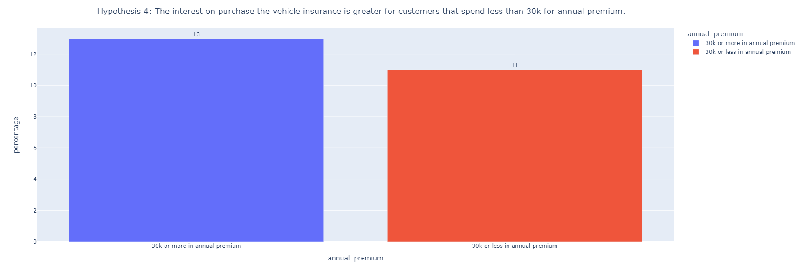

**5. The interest on purchase the vehicle insurance is greater for young customers.(Between 18 and 30 years old.)**
    False, adults and elderlies show greater interest on buying vehicle insurance.
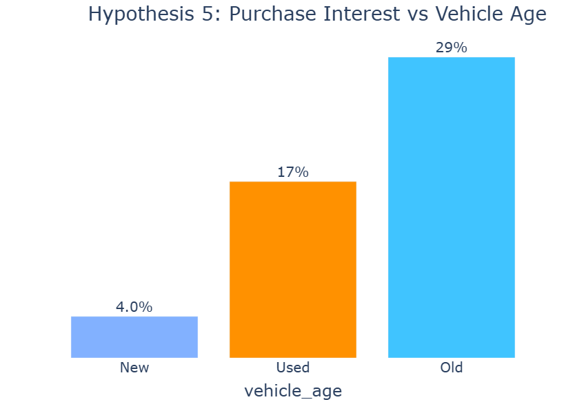

**6. The interest on purchase the vehicle insurance is greater for customers that have driver license.**
    True, arround 12% of customers that hold a driving license show interest in buying the vehicle insurance.
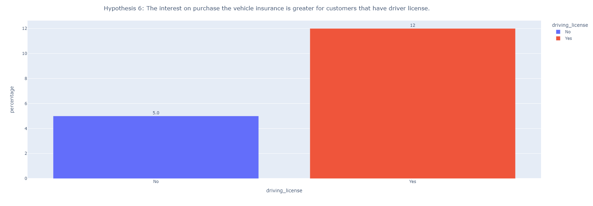

**7. The interest on purchase the vehicle insurance is greater for customers that have new cars.**
    False, the interest is greater for customers that own an old car.
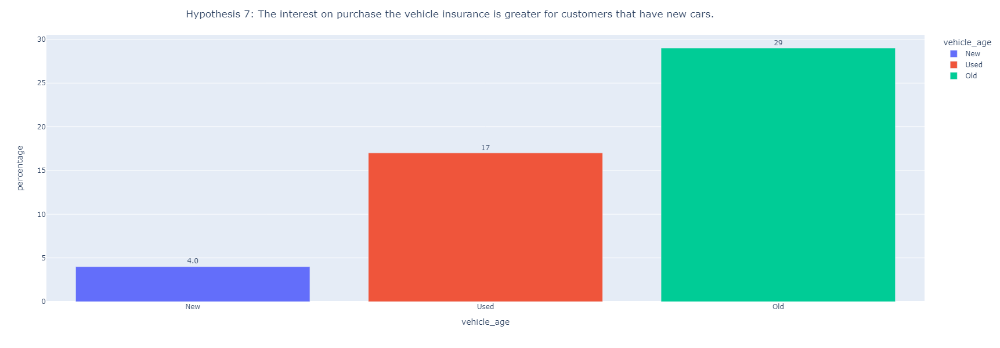

**8. The interest on purchase the vehicle insurance is greater for customers that have new cars and have damaged their vehicles.**
    False, of the customers who damaged their car, the ones that own a old car show greater interest in buying the vehicle insurance (29%), followed by customers that own used cars (27%).
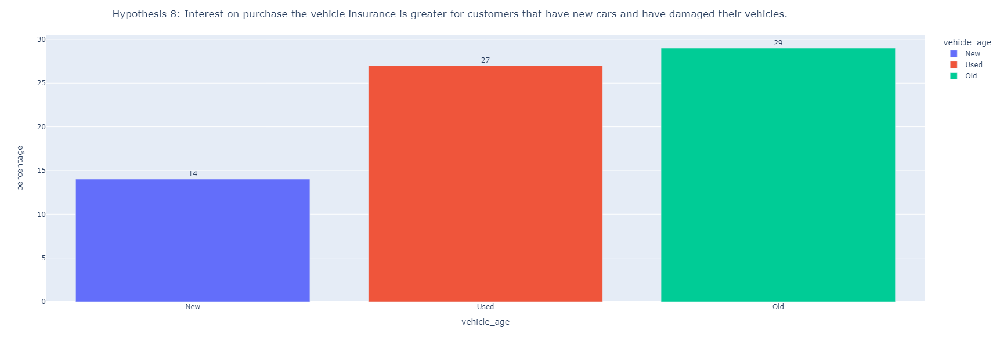

**9. The interest on purchase the vehicle insurance is greater for elderly women.**
    False, adult women show greater interest in buying the vehicle insurance.
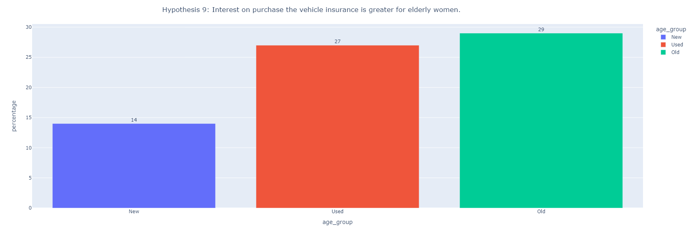

**10. The interest on purchase the vehicle insurance is lower for customers that are already insured.**
    True, less than 1% of customers already insured show interest on purchase the vehicle insurance.
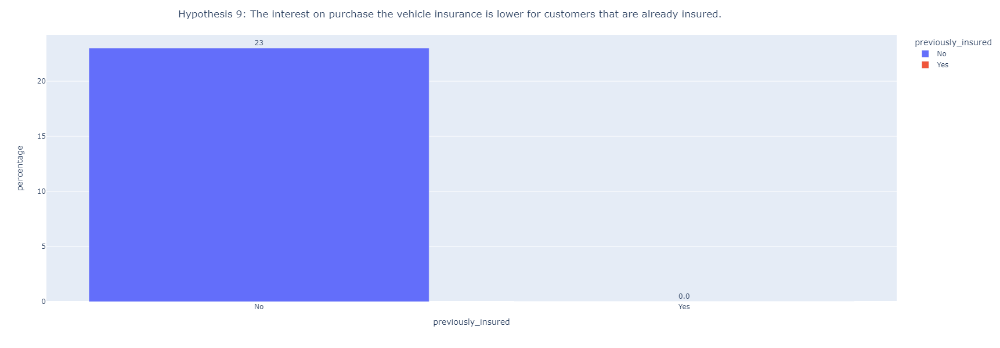

# 4 - Business Results
## 4.1 - Assumptions

1 - The cost for contacting each client has been set at $40.00.

2 - The minimum price for the new product has been set at $1,100.00.

3 - Scores above 0.6 have been set to represent interested customers.

## 4.2 - Business Questions

### 1 - What percentage of customers interested in purchasing car insurance will the sales team be able to contact by making 20,000 calls?
**By doing 20.000 calls, the sales team will make contact with 32% of the interested customers, resulting in a revenue of $6.179.500,00.**

### 2 - If the sales team's capacity increases to 40,000 calls, what percentage of customers interested in purchasing car insurance will the sales team be able to contact?
**By doing 40.000 calls, the sales team will make contact with 16% of the interested customers, resulting in a revenue of 5.379.500,00.**

### 3 - How many calls does the sales team need to make to contact 80% of customers interested in purchasing car insurance?
**By doing 5076 calls, the sales team will make contact with 80% of the interested customers, resulting in a revenue of $6.776.460,00**

# 5 - Next Steps

As this was the first cycle, there are improvements to be considered in order to achieve the best performance.
- Work on feature engineering, creating new features that could better explain the phenomenon.
- Work on fine tunning, focused on find the best parameter to improve the metric.
- Get more data and re-training the ML model.

# AUTHOR
Ricardo Perottoni

# All Rights Reserved - Comunidade DS 2022
