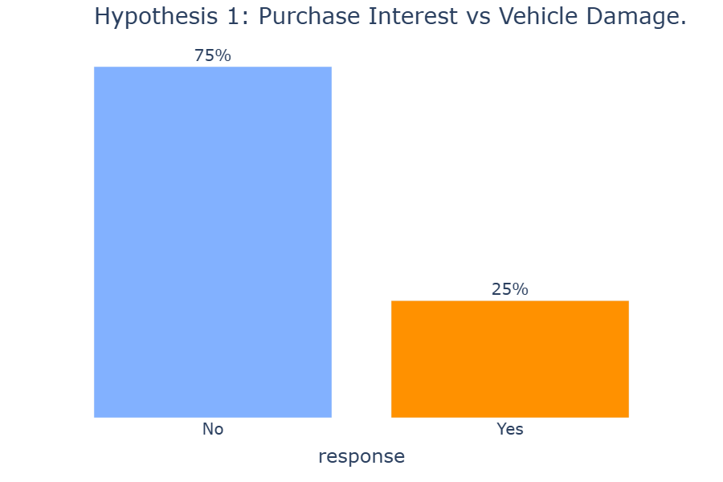
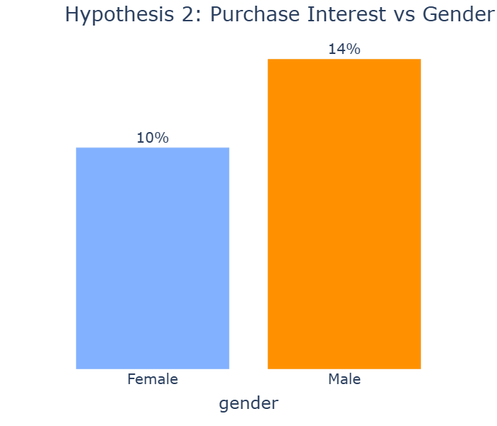
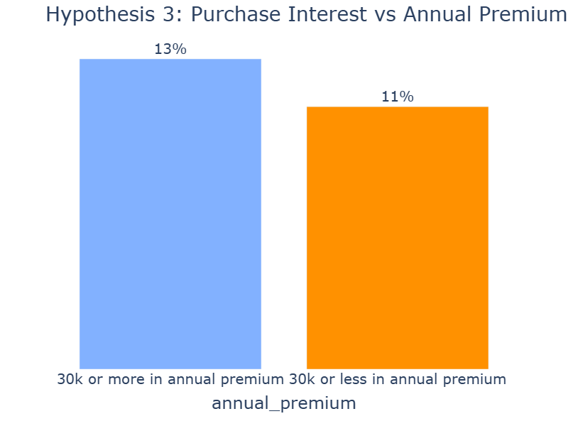
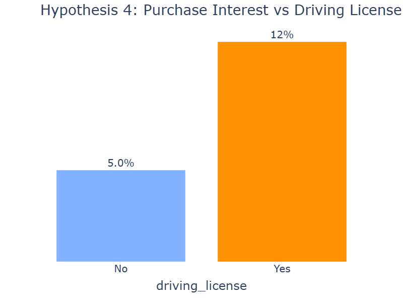
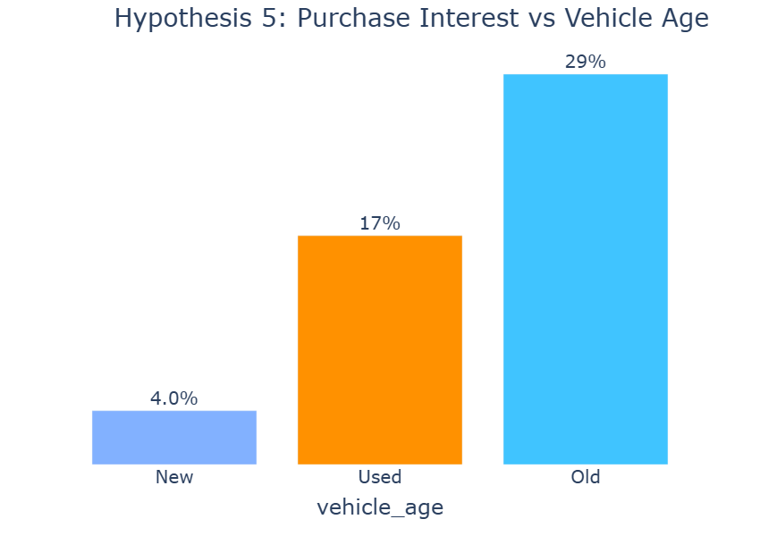
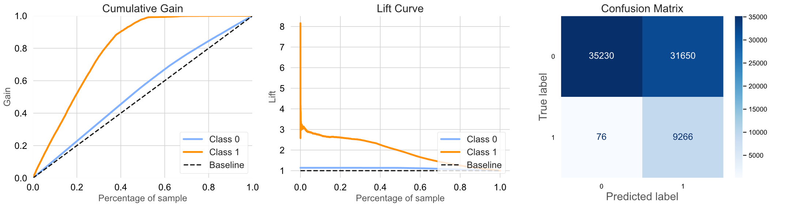

# HEALTH INSURANCE CROSS-SELL

**Disclaimer**: Health Insurance Cross Sell is a Learn to Rank project, based on this [Kaggle Competition](https://www.kaggle.com/datasets/anmolkumar/health-insurance-cross-sell-prediction). The context, company and business problem are ficticial.

# 1. Business Scenario

 The client is an Insurance company that has provided health insurance to its customers. Now they need our help in building a model to predict whether the policyholders (customers) from past year will also be interested in Vehicle Insurance provided by the company.

## 1.1 - Insurance All

Insurance All is a company that provides health insurance to its customers and the product team analyzed the possibility of offering to its customers a new product: A car insurance. To conduct this analysis, the company interviewed approximatelly 380.000 customers about their interest in acquire the vehicle insurance. Afterwards, the company decided to lunch this product and the sales team will get in touch with some customers, that did not participate of this research, offering the new car insurance.

## 1.2 - Business Problems

 The sales team received the mission of contact the customers, however they checked the database and there are approximatelly 127.000 new customers and the sales team does not have the resources to contact all of them, they have capacity to contact 20.000 people. Then, the question is: <b>How to select the 20.000 customers that are more likely in buying the vehicle insurance?</b>

In this context, I have been hired as a Data Science consultant, aiming to develop a solution that will help the comercial team to contact the 20.000 customers more likely in buying the new product.

# 2. Solution Strategy

 The solution will be developed based on the <b>CRISP-DM</b> (Cross-Industry Standard Process for Data Mining), which is a cyclic method of development. At the end of the first cycle, the team will have a first version end-to-end of this solution, allowing them to achieve good results faster, identify and address potential problems effectively. 

Below, I will comment the steps that I have done in order to develop the project

### 2.1 - **Business Problem**

Before to start with the hands on the programmin, it is important to understant the business problem and align the objective and what is expected as a solution.

As previously mentioned, the aim of this project is to generate a sorted list from the more likely customer to purchase the product to the customer less likely to buy it. Then, I am going to have two different datasets, one that will be used to develop the solution, that contains the data from the interview and the other one that contains the customers that woul be contacted.

The project resolution follows the steps below.

### 2.2 - **Data Extraction and Data Cleaning**

Collecting, uploading, accessing the data to be used to solve the business questions. And runing an initial check on the datas to identify:

* Number of Rows
* Number of Columns
* Data Types
* NaN Values
* Statistic Analysis (Central tendency, dispersion, etc.) 
* Split the dataset into train, validation and test dataset, avoiding data leakage during the machine learning training process

### 2.3 - **Exploratory Data Analysis:** 

On this phase tree types of analysis are made:

* **Univariate Analysis:** To understand the distribution of each feature, if there are outliers, if it is a normal distribution, etc.
* **Bivariate Analysis:** Where some business hyphotesis are made and validate
* **Multivariate Analysis:** Correlation analysis among all features.

### 2.4 - **Data Modeling and Feature Engineering:**

Feature engineering consists in derivate/modify (new) features from the existing ones, aiming to find something that can help to better explain the phenomenon of study.

Modeling consists in work with the datas aiming to adjust them according the machine learning principles. Below, are some exemples about what are done in this phase:

* Handling with missing values (NaN): fill, remove, filter, etc.
* Encoding: change from categorical to numerical
* Scaling and Normalization: ensure the numerical variables are on a similar scale.
* Dimensionality Reduction: Applying techniques like Principal Component Analysis (PCA) to reduce the number of features while preserving as much information as possible.
* Feature Engineering: Iteratively selecting and refining features based on their importance or relevance to the problem.

### 2.5 - **Machine Learning Modelling:**

**Model Selection:** Choose appropriate machine learning algorithms based on the nature of the problem and data.

**Training and Evaluation:** Train models on the training set and evaluate their performance using the testing set.

**Hyperparameter Tuning:** Fine-tune model hyperparameters to optimize performance. This involves adjusting parameters that are not learned from the training data, such as learning rates or regularization terms.

### 2.6 - **Evaluation**

The evaluation phase involves analyzing the performance of the machine learning model to determine whether it meets the established criteria and is satisfactory for further advancement in the project. During this step, the chosen performance metrics are compared with the actual process or results.

### 2.7- **Deployment** 
Publish the model in a cloud environment so that other people or services can use the results to improve the business decision.

# 3. Business Hypothesis and Insights

 On this step, I will share the business hyphotesis that have been validated during the project development. This could guide and generate some insights that could be usefull and applicable even before the first version of the project be ready. 

**1. Taking into account customers who have previously had their cars damaged and have not had insurance before, the majority of them are interested in acquiring insurance. The result can provide insights for the company where it can create programs to attract one or more customer profiles.**

**Hypothesis False**. 75% of the customers does not have interest in buying the vehicle insurance.

**2. The interest on purchase the vehicle insurance is greater for woman than men.**

**Hypothesis is false**. Only 10% of women express interest in buying vehicle insurance, compared to 14% of men.

**3. The interest on purchase vehicle insurance is greater for vintage customers ( 7 months or more ).**

**Hyphothesis is false**. The interest in buying the insurance is greater within the customers that spent more than 30k.

**4. The interest on purchase the vehicle insurance is greater for young customers.(Between 18 and 30 years old.)**

**Hyphotesis is true.** 12% of the customers that hold driving license shows interest in buying the vehicle insurance while only 5% of the customers that does not have driving license shows interest in acquire the insurance. 

**5. The interest on purchase the vehicle insurance is greater for customers that have new cars.**

**Hypothesis is false.** The interest is greater within customers that have old cars.

# 4. Data Pre-Processing

Some machine learning models can perform with the data on the original form (categorical values, outliers, etc.), however it's performance won't be the best that it could. In order to standardize the data it will be applied some techniques that helps the machine learning algorithms to perform better.

For the numercial variables, the below techniques will be applied:

- **Min. Max Scaler**: This will be applied on features that does not follow a normal distribution and does not have outliers;

- **Robust Scaller**: This will be applied on features that contains very high / very low values (outliers)

In relation to the categorial variables, the below techniques will be applied:

- **Target Encoder**: Calculates the mean value of the target variable for each category of the feature and replaces the category value with the calculated mean.

- **Frequency Encoder**: Calculates the frequency of occurrence for each category of the feature and replaces the category value with the calculated frequency.

# 5. Feature Selection

Depending on the business problem, volum of data and other factors, it is interesting to run a feature selection. Where a selected machine learning model is performed to calculate the importance of each feature for the machine learning performance. "How much does the feature helps to understand the phenomenon"? This results can be combined with exploratory data analysis and it is possible to select or exclude features that do not help and have lower influence on the machine learning performance. It helps to reduce the dimensionality of the data and the size of the model.

# 6. Machine Learning

Now, I am ready to explore the machine learning universe, where some of machine learning models have been evaluated, their performance have been compared each other and one of them have been selected to further advance the project. Their performance can be checked at the table below. The machine learning models will be evaluated with some metrics, however the most important one for this project is the recall, because I am interested in identify as much interested customers as possible. 

| ML Model                | Precision @K         | Recall @K              |
|:------------------------|:-------------------- |:-----------------------|
| Logistic Regression     | 0.24966              | 0.978912               | 
| XGB Classifier          | 0.278177             | 0.931813               |
| KNN                     | 0.32056              | 0.200385               |
| CatBoost Classifier     | 0.269406             | 0.958146               | 
| LGBM Classifier         | 0.26826              | 0.957611               |
| ExtraTrees Classifier   | 0.340441             | 0.153821               |

I am evaluating the machine learning models with some metrics:

- **Precision**: It measuers the proportion of correct predictions in relation the total of predictions made.
- **Recall**: It measures the proportion of correct predictions in relation to the number of data available for the class of interest.
- **Cumulative Gain Chart**: It shows the percentage of labels identified in relation to the percentage of sample. Please, assess the project to have a better understanding of this chart.
- **Lift Curve Chart**: It represents the machine learning performance in comparison to the baseline (standard process). Please, assess the project to have a better understanding of this chart.
- **Confusion Matrix**: It shows the quantity of data classified correcly and wrong per class. Please, assess the project to have a better understanding of this chart.

## 6.1 Machine Learning Fine Tuning

 The fine tuning were performed by using a bysean method using optuna. And the choosen metric that will be considere is recall. 

| ML Model                | Recall @K            |           
|:------------------------|:-------------------- |
| Logistic Regression     | 0.9789               |
| XGB Classifier          | 0.9994               |
| CatBoost Classifier     | 0.9822               | 

After the fine tuning, I have decided to further advance with the XGB Classifier, and it's performance will be explained below.

To evaluate the XGB Classifier with the parameters tuned, I have concatenated the train and validation dataset and the performance was calculated on the test dataset. 
| ML Model                | Recall @K            |           
|:------------------------|:-------------------- |
| XGB Classifier          | 0.991865             |

Analyzing the Cumulative Gain chart, it is possible to identify that XGB is capable of identifying 100% of the interested customers within around 50% of the data. Through the Lift Curve chart, its performance is 2.5 times better than the baseline (selecting customers randomly). From the confusion matrix, it is evident that XGB classified around 41,000 customers as interested; however, only approximately 9,300 are genuinely interested customers. This is a good result because these 9,300 represent 99% of the customers who have demonstrated interest in buying insurance during the interview.

## 6.2 - Business Problem Solution

 The ultimate solution to this business problem is an API that can be accessed directly from Google Sheets. This solution was developed focusing in being user-friendly and it is a plugin for a tool that the users already are familiar with.

The functionality is illustrated in the image below, where users only need their Google Sheets containing the customer data they want to classify. With just a few clicks, they can obtain a sorted list of customers, starting with the most likely to purchase the product and ending with the least likely. 

# 7. Next Steps
As this was the first cycle, there are improvements to be considered in order to achieve the best performance.
- Work on feature engineering, creating new features that could better explain the phenomenon.
- Uses differents methods to transform the data.
- Get more data and re-training the ML model.
- Try to use others ML Models.

# 8. Technologies

# AUTHOR
Ricardo Perottoni